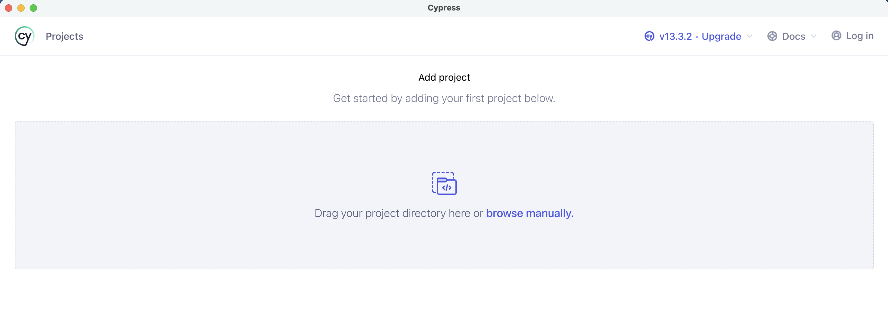

### Create a cypress demo

`mkdir cypress-demo && cd cypress-demo`

Create I10n.config.json in cypress demo

```json
{
  "initLocales": ["zh-Hans", "ja"],
  "initLocaleOptions": [
    {
      "locale": "zh-Hans",
      "language": "简体中文"
    },
    {
      "locale": "ja",
      "language": "日本語"
    },
    {
      "locale": "abc",
      "language": "谁也看不懂语"
    }
  ]
}
```


### Run Cypress

```
git clone git@gitlab.eng.vmware.com:g11n/automation/g11n-integration/cypress/cypress.git
nvm use 18.15.0
yarn
yarn run dev
```

Wait a minute, installing and starting cypress for the first time may be a little slow, if the loading animation persists, you can manually refresh by pressing Command + R.



Select your new cypress project and follow the step-by-step instructions


### Replace default test case

In the file cypress/e2e/spec.cy.js, replace the default with the following code

```javascript
import { L10n } from '../i10n'

const languageDropDown = {
  self: '[aria-label="language"]',
  languageMenu: `.dropdown-menu`
}

const verifyLocale = (locale) => {
  if (locale) {
    cy.log(`Current locale is：${locale}`);
    const t = L10n.commonMsg(locale)
    // const t = L10n.specialMsg('SampleProduct', '1.0.0', 'SampleComponent', locale)
    const url = 'https://console-stg.cloud.vmware.com/csp/gateway/discovery'
    cy.visit({ url, headers: { 'Accept-Language': t('localeJs') }} )
    changeLoginUiLanguageInPasswordPage(t('language'))

  } else {
    cy.log('Not found');
  }
}

const changeLoginUiLanguageInPasswordPage = (language) => {
  cy.get(languageDropDown.self).should('be.visible').click()
  cy.get(languageDropDown.languageMenu).contains(language).click()
}

describe('template spec', () => {
  it('passes', () => {
    cy.getLocal().then(verifyLocale)
  })
})

```
Go back to your browser to see the latest tests